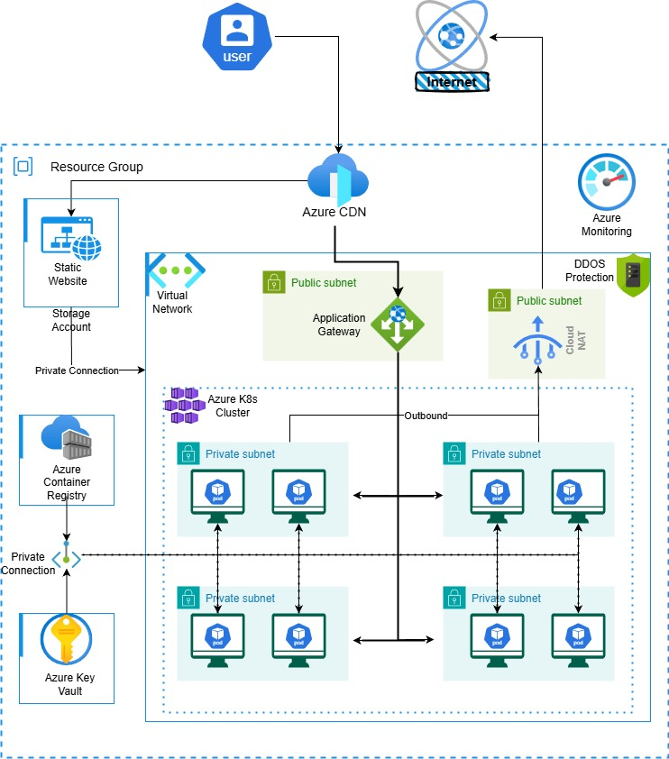

# Azure Kubernetes Stack with Terraform



This repository contains Terraform code to provision a complete Azure infrastructure stack, including networking, storage, Kubernetes (AKS), Application Gateway, and CDN, following modular best practices. The code is organized for easy customization and reuse.

## Features
- **Resource Group**: Centralized resource group for all resources
- **Networking**: Virtual Network (VNet) with configurable subnets and optional DDoS protection for you Infrastructure
- **Storage Account**: Secure static website hosting with private endpoints connection with Networking and CDN
- **Kubernetes (AKS)**: Production-ready Private AKS k8s cluster with managed identities and RBAC
- **Azure CDN/Front Door**: Global content delivery integration with static website hosting and Application Gateway
- **Key Vault & Monitoring**: Secure secrets management with AKS k8s cluster with private connectivity and monitoring (extendable)
- **Modular Structure**: Each major component is a separate Terraform module for clarity and reuse. To use this module for your requirements, simply update the `terraform.tfvars` file and the entire infrastructure will be created as per your needs.
## Directory Structure
- `main.tf` – Root module wiring all submodules together
- `provider.tf` – Azure provider configuration
- `backend.tf` – Remote state configuration (Azure Storage Account)
- `variable.tf` – Input variables for customization
- `terraform.tfvars` – Example variable values
- `locals.tf` – Local values
- `CDN/` – CDN/Front Door resources
- `k8s_cluster/` – AKS cluster, identities, Key Vault, monitoring
- `networking/` – VNet, subnets, NSGs, NAT Gateway
- `storage_acc/` – Storage account, DNS zone, private endpoint

## Prerequisites
- [Terraform](https://www.terraform.io/downloads.html) >= 1.5.0
- [Azure CLI](https://docs.microsoft.com/en-us/cli/azure/install-azure-cli)
- Azure Subscription with sufficient permissions

## Usage
1. **Clone the repository**
   ```sh
   git clone <repo-url>
   cd Azure_k8s_stack_terraform
   ```
2. **Configure backend**
   Edit `backend.tf` with your Azure Storage Account details for remote state.
3. **Customize variables**
   Edit `terraform.tfvars` or override variables as needed.
4. **Initialize Terraform**
   ```sh
   terraform init
   ```
5. **Plan the deployment**
   ```sh
   terraform plan
   ```
6. **Apply the deployment**
   ```sh
   terraform apply
   ```

## Customization
- All major settings (names, regions, CIDRs, VM sizes, etc.) are exposed as variables in `variable.tf`.
- Enable/disable DDoS protection, adjust AKS node pools, and configure CDN via variables.
- Extend modules for Key Vault, Azure Container Registry, monitoring, or additional Azure resources as needed.

## Security & Best Practices
- Uses Azure AD authentication for provider
- Supports private endpoints for storage
- Modular code for maintainability
- Remote state recommended for team use

## Clean Up
To destroy all resources:
```sh
terraform destroy
```
